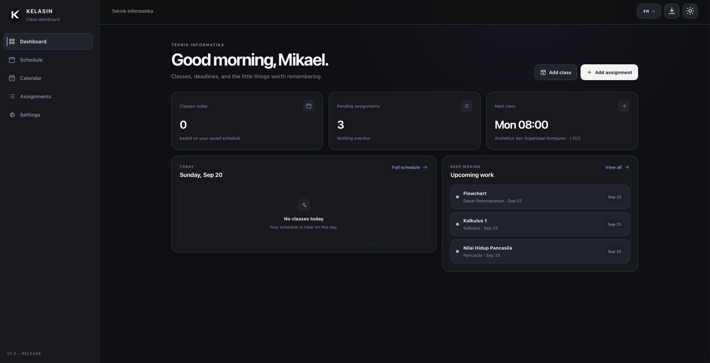
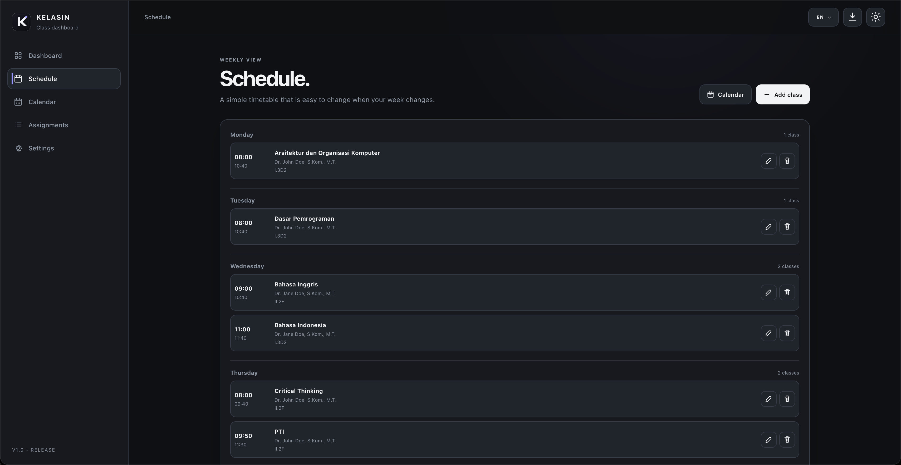
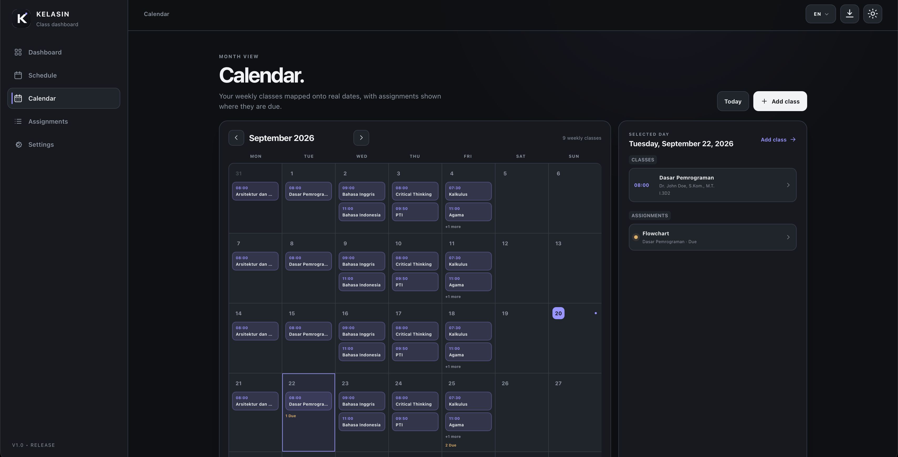
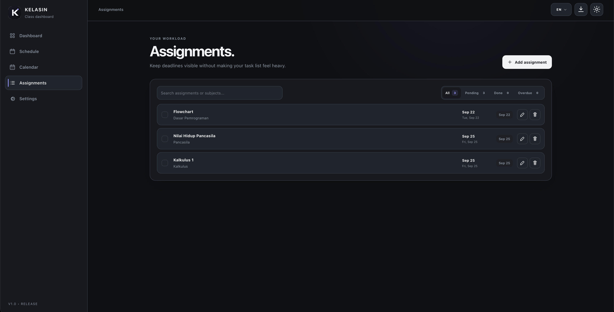
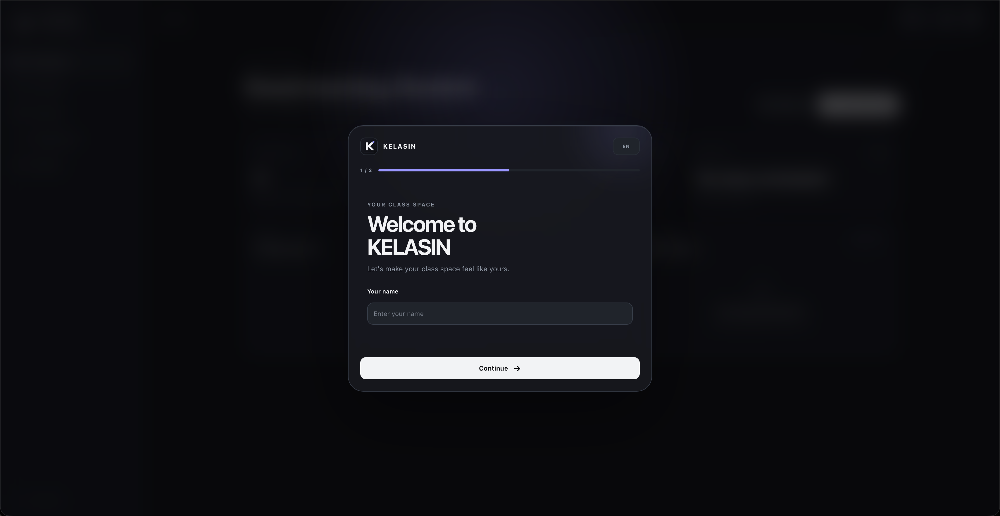
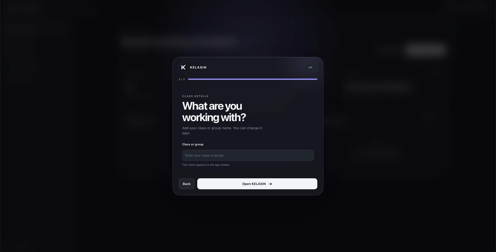

# KELASIN

### Your classes, assignments, and academic schedule in one place.

**v1.0 Release**

[View the KELASIN repository](https://github.com/biasedfilms/kelasin)

KELASIN is a student-focused, local-first class management app for organizing recurring classes, assignments, calendar activity, lecturers, subjects, and holidays in one focused workspace.

## Preview

  

  

  

  

### First Launch

  
  

## What's included in v1.0

- Recurring weekly class management with lecturer and room details.
- Monthly calendar for classes and assignment deadlines.
- Date-specific holidays that skip recurring classes without changing the weekly schedule.
- Holiday-aware Dashboard, Calendar, and next-class information.
- Assignment tracking with search, filters, completion states, and overdue status.
- Subject and lecturer autocomplete based on existing local class data.
- English and Bahasa Indonesia interface support.
- Dark and light themes.
- JSON backup export and import.
- Installable PWA with responsive desktop and mobile layouts.

## Product Overview

KELASIN is designed for students who want a clear view of their weekly classes and upcoming academic work without creating an account or depending on a cloud service.

The app keeps recurring classes, assignments, calendar dates, lecturers, and holidays together. The weekly schedule remains stable, while the Calendar and Dashboard show what actually applies to a specific date.

## Features

### Dashboard

The Dashboard gives a quick view of the day:

- Today's classes and current class state.
- Pending assignment count and overdue work.
- The next scheduled class.
- Holiday-aware empty states when classes do not take place.
- Quick actions for adding a class or assignment.

### Schedule

Schedule represents the recurring weekly timetable.

- Add, edit, and delete classes.
- Organize classes by weekday and start time.
- Store subject, lecturer, room, start time, and end time.
- Prevent overlapping classes on the same day.
- Keep the recurring schedule unchanged when a holiday is added.

### Calendar

Calendar maps the recurring schedule and assignments onto actual dates.

- Monthly view with previous month, next month, and Today controls.
- Recurring classes shown on their matching weekdays.
- Assignment deadlines shown on their due dates.
- Selected-day agenda for classes and assignments.
- Quick class creation from the selected date.
- Holiday indicators and holiday details.
- Classes hidden on holidays while assignments remain visible.

### Assignments

- Add, edit, delete, and complete assignments.
- Search by assignment title or subject.
- Filter by all, pending, done, or overdue.
- See due-date labels and overdue states at a glance.

### Holidays

Holidays are local, date-specific exceptions to the recurring class schedule.

- Add a holiday name and date.
- Edit or delete existing holidays.
- Hide recurring classes on marked dates without deleting the original class.
- Keep assignment deadlines visible on holidays.
- Reflect holidays in Calendar, Dashboard, and next-class lookup.
- Restore normal class behavior automatically when a holiday is deleted.

### Subjects & Lecturers

Class forms include both subject and lecturer information.

- Subject autocomplete from existing local classes.
- Lecturer autocomplete from existing local classes.
- Unique suggestions with case-insensitive, whitespace-tolerant matching.
- Arrow-key navigation, Enter selection, Escape dismissal, mouse selection, and touch support.
- Manual entry remains available for new subjects and lecturers.

### Settings & Personalization

- English and Bahasa Indonesia interface.
- Dark and light themes.
- Local holiday management.
- JSON export and import for workspace backups.
- First-launch profile setup for a name and class or group.
- Delete-all-data reset that returns the app to its initial state.

## Local-first by design

KELASIN stores profile data, classes, assignments, preferences, and holidays in the browser using `localStorage`.

No account, backend, cloud synchronization, analytics service, or external holiday API is required. JSON export and import make it possible to create a backup or move a workspace manually.

Clearing browser or site data can remove the local workspace, so export a backup before changing browsers or devices.

## Installable

KELASIN works as a Progressive Web App with a web app manifest, application icons, a service worker, and a cached application shell. It is designed for modern desktop and mobile browsers and can be installed as a standalone app where the platform supports PWA installation.

## Designed for everyday use

The interface is intentionally minimal and focused, with responsive layouts for desktop, tablet, and mobile screens. Dark and light themes, touch-friendly controls, subtle transitions, keyboard focus handling, and reduced-motion support are built into the experience.

## Built with

- HTML
- CSS
- Vanilla JavaScript
- Browser Web APIs
- `localStorage`
- Service Worker
- Web App Manifest

## Browser notes

KELASIN is intended for modern browsers. PWA installation and offline application-shell behavior can vary by browser and platform.

## v1.0 Release

KELASIN v1.0 is the first official public release of the complete local-first class management experience.

## Changelog

See [CHANGELOG.md](CHANGELOG.md) for the detailed development history.

## Repository

[github.com/biasedfilms/kelasin](https://github.com/biasedfilms/kelasin)

## License

MIT. See [LICENSE](LICENSE).
